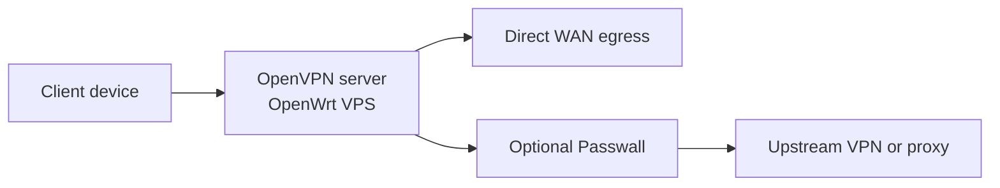

[English](README.md) | [Русский](README.ru.md) | [简体中文](README.zh-CN.md) | [Tiếng Việt](README.vi.md) | [Español](README.es.md)

# AntiDetect Router

Bootstrap de un solo comando para OpenWrt en VPS: servidor OpenVPN de entrada con Passwall opcional.

El instalador recomendado es `roadwarrior-installer.sh`. Este script instala LuCI, OpenVPN, `dnsmasq-full`, PKI, reglas de firewall, management routing, comandos auxiliares y genera un archivo `.ovpn` listo para importar.

> Estado: beta temprana
>
> Ruta de instalación recomendada: `roadwarrior-installer.sh`

## Inicio rápido

```bash
ssh root@YOUR_SERVER_IP
wget -O roadwarrior-installer.sh https://raw.githubusercontent.com/vektort13/AntidetectRouter/main/roadwarrior-installer.sh
sh roadwarrior-installer.sh
```

Si tu VPS con OpenWrt arranca sin DHCP funcional en la interfaz pública, primero levanta la red desde la consola:

```sh
uci set network.lan.proto='dhcp'
uci commit network
ifup lan
```

## Qué ofrece este repositorio

- un solo script para un VPS OpenWrt limpio
- instalación guiada con valores por defecto razonables
- servidor OpenVPN con perfil de cliente generado automáticamente
- instalación opcional de feeds y GUI de Passwall
- comandos auxiliares para estado y recuperación
- los perfiles de cliente se guardan en `/root`, no se publican por web

El instalador solo pide seis valores: interfaz WAN, puerto UDP, nombre del cliente, subred IPv4, subred IPv6 y la IP pública o el hostname.

## Flujo



```text
Dispositivo cliente
        |
        v
Servidor OpenVPN en OpenWrt VPS
        |
        +--> Salida directa por WAN
        |
        +--> Passwall opcional --> VPN / Proxy upstream
```

## Qué obtienes al final

- `/root/<client-name>.ovpn`
- `rw-help` para ver estado, puertos abiertos, logs y clientes conectados
- `rw-fix` para recuperar rutas y servicios
- LuCI en `https://YOUR_SERVER_IP`
- `/root/roadwarrior-credentials.txt` si el script tuvo que generar la contraseña de root

Para descargar el perfil del cliente:

```bash
scp root@YOUR_SERVER_IP:/root/client1.ovpn .
```

## Resumen de la última versión

La versión `0.6.0` se centra en hardening y seguridad de runtime:

- validación reforzada de entradas CGI y respuestas JSON
- rollback del firewall si Passwall falla al iniciar
- DNS de respaldo en la configuración de Passwall
- pequeñas correcciones de shell en scripts de monitoreo y routing

Detalles completos: [CHANGELOG.md](CHANGELOG.md)

## Documentación

- [English README](README.md)
- [Русская версия](README.ru.md)
- [简体中文版本](README.zh-CN.md)
- [Bản tiếng Việt](README.vi.md)
- [Versión en español](README.es.md)
- [Changelog](CHANGELOG.md)

## Estructura del repositorio

- `roadwarrior-installer.sh`: instalador actual recomendado
- `webui/`: panel de control web — frontend (HTML/JS/CSS), scripts CGI, instaladores
- `rwpatch/`: herramientas de runtime — conmutador VPN, monitores, diagnósticos
- `legacy/`: instaladores antiguos conservados como referencia
- `dist/`: archivos pre-compilados
- `assets/`: archivos multimedia del repositorio

## Notas

- este README documenta la ruta de instalación actual de RoadWarrior, no todos los scripts históricos del repositorio
- la publicación pública de `.ovpn` por web está deshabilitada en el instalador recomendado actual
- los perfiles de cliente generados actualmente usan `AES-256-GCM` y `tls-crypt`