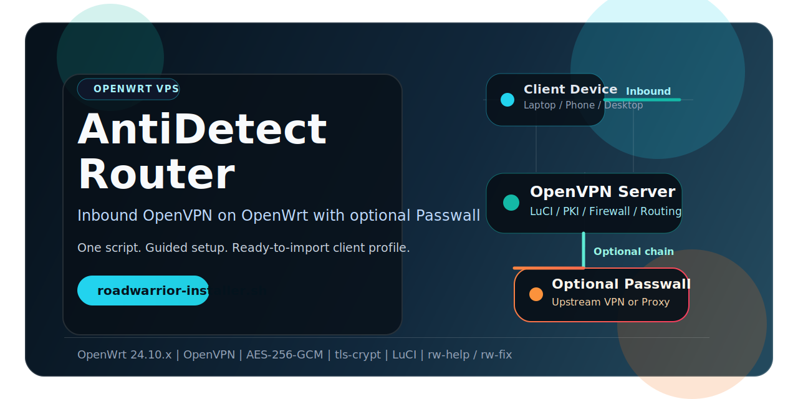
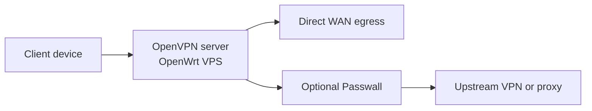

<p align="center">
	
</p>

<p align="center">
	<a href="CHANGELOG.md"></a>
	
	
	
	
</p>

<p align="center">
	<a href="README.md">English</a> • <a href="README.ru.md">Русский</a> • <a href="README.zh-CN.md">简体中文</a> • <a href="README.vi.md">Tiếng Việt</a> • <a href="README.es.md">Español</a>
</p>

<h1 align="center">AntiDetect Router</h1>

<p align="center">
	One-command OpenWrt VPS bootstrap for an inbound OpenVPN server with optional Passwall.
</p>

<p align="center">
	<strong>Recommended installer:</strong> <code>roadwarrior-installer.sh</code><br />
	Installs LuCI, OpenVPN, dnsmasq-full, PKI materials, firewall rules, management routing, helper commands, and generates a ready-to-import <code>.ovpn</code> profile.
</p>

<p align="center">
	<a href="#quick-start"><strong>Quick Start</strong></a> • <a href="#flow"><strong>Flow</strong></a> • <a href="CHANGELOG.md"><strong>Changelog</strong></a>
</p>

> Fresh OpenWrt VPS in, ready-to-import OpenVPN profile out.

## Quick Start

```bash
ssh root@YOUR_SERVER_IP
wget -O roadwarrior-installer.sh https://raw.githubusercontent.com/vektort13/AntidetectRouter/main/roadwarrior-installer.sh
sh roadwarrior-installer.sh
```

If your OpenWrt VPS comes up without working DHCP on the public interface, bring networking up first from the console:

```sh
uci set network.lan.proto='dhcp'
uci commit network
ifup lan
```

## Why This Repo

- one script for a fresh OpenWrt VPS
- guided setup with sane defaults
- OpenVPN server with generated client profile
- optional Passwall feeds and GUI installation
- helper commands for status and recovery
- current client profiles stay in `/root`, not on a public web page

The installer asks for only six values: WAN interface, UDP port, client name, IPv4 subnet, IPv6 subnet, and public IP or hostname.

## Flow



```text
Client device
	|
	v
OpenVPN server on OpenWrt VPS
	|
	+--> Direct WAN egress
	|
	+--> Optional Passwall --> Upstream VPN / Proxy
```

## What You Get

- `/root/<client-name>.ovpn`
- `rw-help` for status, listeners, logs, and connected clients
- `rw-fix` for route and service recovery
- LuCI at `https://YOUR_SERVER_IP`
- `/root/roadwarrior-credentials.txt` if the script had to generate a root password

To download the generated client profile:

```bash
scp root@YOUR_SERVER_IP:/root/client1.ovpn .
```

## Latest Release Summary

Version `0.6.0` focuses on hardening and runtime safety:

- CGI input validation and JSON response hardening
- firewall rollback when Passwall startup fails
- fallback DNS in Passwall settings
- small shell-quality fixes in monitoring and routing helpers

Full details: [CHANGELOG.md](CHANGELOG.md)

## Docs

- [English README](README.md)
- [Русская версия](README.ru.md)
- [简体中文版本](README.zh-CN.md)
- [Bản tiếng Việt](README.vi.md)
- [Versión en español](README.es.md)
- [Changelog](CHANGELOG.md)

## Repository Layout

- `roadwarrior-installer.sh`: current recommended installer
- `webui/`: web control panel — frontend (HTML/JS/CSS), CGI scripts, installers
- `rwpatch/`: runtime helpers — VPN switcher, monitors, diagnostics
- `legacy/`: older installers kept for reference
- `dist/`: pre-built archives
- `assets/`: repository media

## Notes

- this README documents the current RoadWarrior install path, not every historical script in the repository
- public `.ovpn` web publishing is disabled in the current recommended installer
- current generated client configs use authenticated encryption with `AES-256-GCM` and `tls-crypt`