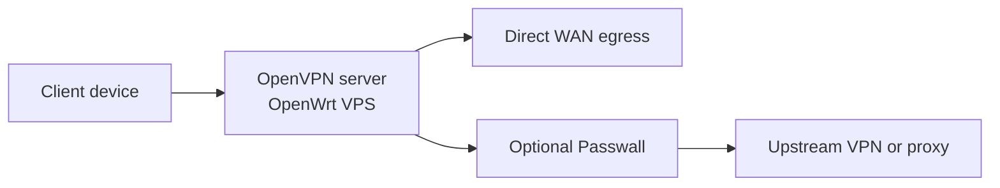

[English](README.md) | [Русский](README.ru.md) | [简体中文](README.zh-CN.md) | [Tiếng Việt](README.vi.md) | [Español](README.es.md)

# AntiDetect Router

Однокомандный bootstrap для OpenWrt VPS: входящий OpenVPN-сервер с опциональным Passwall.

Рекомендуемый установщик: `roadwarrior-installer.sh`. Он ставит LuCI, OpenVPN, `dnsmasq-full`, PKI, правила фаервола, management routing, helper-команды и генерирует готовый `.ovpn`-профиль.

> Статус: ранняя beta
>
> Рекомендуемый путь установки: `roadwarrior-installer.sh`

## Быстрый старт

```bash
ssh root@YOUR_SERVER_IP
wget -O roadwarrior-installer.sh https://raw.githubusercontent.com/vektort13/AntidetectRouter/main/roadwarrior-installer.sh
sh roadwarrior-installer.sh
```

Если OpenWrt на VPS стартует без рабочего DHCP на публичном интерфейсе, сначала подними сеть из консоли:

```sh
uci set network.lan.proto='dhcp'
uci commit network
ifup lan
```

## Зачем этот репозиторий

- один скрипт для чистого OpenWrt VPS
- guided setup с нормальными дефолтами
- OpenVPN-сервер с автоматически созданным клиентским профилем
- опциональная установка Passwall feeds и GUI
- helper-команды для статуса и восстановления
- клиентские профили хранятся в `/root`, а не публикуются через веб

Скрипт спрашивает только шесть значений: WAN interface, UDP port, client name, IPv4 subnet, IPv6 subnet и public IP или hostname.

## Схема потока



```text
Клиентское устройство
        |
        v
OpenVPN server на OpenWrt VPS
        |
        +--> Прямой выход через WAN
        |
        +--> Optional Passwall --> Upstream VPN / Proxy
```

## Что получаешь после установки

- `/root/<client-name>.ovpn`
- `rw-help` для статуса, listening ports, логов и списка подключенных клиентов
- `rw-fix` для восстановления маршрутов и сервисов
- LuCI по адресу `https://YOUR_SERVER_IP`
- `/root/roadwarrior-credentials.txt`, если скрипт сам сгенерировал пароль root

Скачать клиентский профиль:

```bash
scp root@YOUR_SERVER_IP:/root/client1.ovpn .
```

## Кратко о последнем релизе

Версия `0.6.0` сфокусирована на hardening и runtime safety:

- усилена валидация CGI-входов и JSON-ответов
- добавлен rollback фаервола при неудачном старте Passwall
- добавлен fallback DNS в настройках Passwall
- внесены мелкие shell-фиксы в мониторинге и роутинге

Полный список изменений: [CHANGELOG.md](CHANGELOG.md)

## Документация

- [English README](README.md)
- [Русская версия](README.ru.md)
- [简体中文版本](README.zh-CN.md)
- [Bản tiếng Việt](README.vi.md)
- [Versión en español](README.es.md)
- [Changelog](CHANGELOG.md)

## Структура репозитория

- `roadwarrior-installer.sh`: текущий рекомендуемый установщик
- `webui/`: панель управления — фронтенд (HTML/JS/CSS), CGI-скрипты, установщики
- `rwpatch/`: runtime-помощники — VPN-переключатель, мониторы, диагностика
- `legacy/`: старые установщики, оставлены для справки
- `dist/`: готовые архивы
- `assets/`: медиафайлы репозитория

## Примечания

- этот README документирует текущий путь установки через RoadWarrior, а не все исторические скрипты репозитория
- публичная веб-раздача `.ovpn` отключена в текущем рекомендуемом установщике
- текущие клиентские конфиги используют `AES-256-GCM` и `tls-crypt`