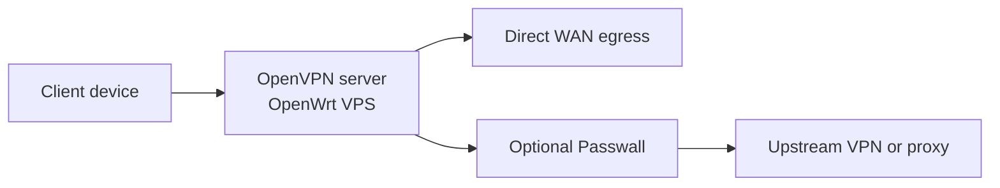

[English](README.md) | [Русский](README.ru.md) | [简体中文](README.zh-CN.md) | [Tiếng Việt](README.vi.md) | [Español](README.es.md)

# AntiDetect Router

Trình bootstrap một lệnh cho OpenWrt VPS: máy chủ OpenVPN đầu vào với Passwall tùy chọn.

Trình cài đặt được khuyến nghị là `roadwarrior-installer.sh`. Script này tự động cài LuCI, OpenVPN, `dnsmasq-full`, PKI, quy tắc tường lửa, management routing, các lệnh trợ giúp và tạo sẵn file `.ovpn` để import.

> Trạng thái: beta giai đoạn đầu
>
> Đường cài đặt khuyến nghị: `roadwarrior-installer.sh`

## Khởi động nhanh

```bash
ssh root@YOUR_SERVER_IP
wget -O roadwarrior-installer.sh https://raw.githubusercontent.com/vektort13/AntidetectRouter/main/roadwarrior-installer.sh
sh roadwarrior-installer.sh
```

Nếu OpenWrt VPS khởi động mà chưa có DHCP hoạt động trên giao diện công cộng, hãy bật mạng trước từ console:

```sh
uci set network.lan.proto='dhcp'
uci commit network
ifup lan
```

## Repo này làm gì

- một script cho VPS OpenWrt mới hoàn toàn
- cài đặt có hướng dẫn với các giá trị mặc định hợp lý
- máy chủ OpenVPN với profile client được tạo tự động
- tùy chọn cài Passwall feeds và GUI
- lệnh trợ giúp cho kiểm tra trạng thái và khôi phục
- profile client được giữ trong `/root`, không công khai qua web

Trình cài đặt chỉ hỏi sáu giá trị: giao diện WAN, cổng UDP, tên client, subnet IPv4, subnet IPv6 và public IP hoặc hostname.

## Sơ đồ luồng



```text
Thiết bị client
      |
      v
OpenVPN server trên OpenWrt VPS
      |
      +--> Đi thẳng ra WAN
      |
      +--> Passwall tùy chọn --> VPN / Proxy upstream
```

## Bạn sẽ nhận được gì

- `/root/<client-name>.ovpn`
- `rw-help` để xem trạng thái, cổng lắng nghe, log và client đang kết nối
- `rw-fix` để khôi phục route và dịch vụ
- LuCI tại `https://YOUR_SERVER_IP`
- `/root/roadwarrior-credentials.txt` nếu script phải tự tạo mật khẩu root

Tải file client về:

```bash
scp root@YOUR_SERVER_IP:/root/client1.ovpn .
```

## Tóm tắt bản phát hành mới nhất

Phiên bản `0.6.0` tập trung vào hardening và an toàn runtime:

- tăng cường kiểm tra đầu vào CGI và JSON output
- rollback firewall khi Passwall khởi động thất bại
- thêm DNS dự phòng trong cấu hình Passwall
- sửa một số lỗi shell nhỏ trong script giám sát và định tuyến

Chi tiết đầy đủ: [CHANGELOG.md](CHANGELOG.md)

## Tài liệu

- [English README](README.md)
- [Русская версия](README.ru.md)
- [简体中文版本](README.zh-CN.md)
- [Bản tiếng Việt](README.vi.md)
- [Versión en español](README.es.md)
- [Changelog](CHANGELOG.md)

## Cấu trúc repo

- `roadwarrior-installer.sh`: trình cài đặt hiện tại được khuyến nghị
- `webui/`: bảng điều khiển web — frontend (HTML/JS/CSS), CGI scripts, trình cài đặt
- `rwpatch/`: công cụ runtime — chuyển đổi VPN, giám sát, chẩn đoán
- `legacy/`: trình cài đặt cũ, giữ lại để tham khảo
- `dist/`: các bản dựng sẵn
- `assets/`: tệp phương tiện repo

## Ghi chú

- README này chỉ mô tả đường cài đặt RoadWarrior hiện tại, không mô tả toàn bộ script lịch sử trong repo
- trình cài đặt khuyến nghị hiện tại không public `.ovpn` qua web
- file client được tạo hiện dùng `AES-256-GCM` và `tls-crypt`