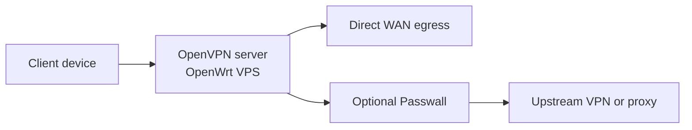

[English](README.md) | [Русский](README.ru.md) | [简体中文](README.zh-CN.md) | [Tiếng Việt](README.vi.md) | [Español](README.es.md)

# AntiDetect Router

适用于 OpenWrt VPS 的一键式引导方案：入站 OpenVPN 服务器，可选 Passwall。

推荐安装器是 `roadwarrior-installer.sh`。它会自动安装 LuCI、OpenVPN、`dnsmasq-full`、PKI、防火墙规则、管理路由、辅助命令，并生成可直接导入的 `.ovpn` 配置文件。

> 状态：早期测试版
>
> 推荐安装路径：`roadwarrior-installer.sh`

## 快速开始

```bash
ssh root@YOUR_SERVER_IP
wget -O roadwarrior-installer.sh https://raw.githubusercontent.com/vektort13/AntidetectRouter/main/roadwarrior-installer.sh
sh roadwarrior-installer.sh
```

如果你的 OpenWrt VPS 启动后公网接口没有正确通过 DHCP 获取网络，请先在控制台执行：

```sh
uci set network.lan.proto='dhcp'
uci commit network
ifup lan
```

## 这个仓库提供什么

- 面向全新 OpenWrt VPS 的单脚本安装
- 带合理默认值的交互式安装流程
- 自动生成客户端配置的 OpenVPN 服务器
- 可选安装 Passwall feeds 和 GUI
- 用于状态查看和故障恢复的辅助命令
- 客户端配置保存在 `/root`，不会公开发布到网页目录

安装器只会询问六个值：WAN 接口、UDP 端口、客户端名称、IPv4 子网、IPv6 子网，以及公网 IP 或主机名。

## 流程图



```text
客户端设备
    |
    v
OpenWrt VPS 上的 OpenVPN 服务器
    |
    +--> 直接走 WAN 出口
    |
    +--> 可选 Passwall --> 上游 VPN / 代理
```

## 安装后会得到什么

- `/root/<client-name>.ovpn`
- `rw-help`：查看状态、监听端口、日志和已连接客户端
- `rw-fix`：恢复路由和相关服务
- LuCI 地址：`https://YOUR_SERVER_IP`
- 如果脚本自动生成了 root 密码，则会保存到 `/root/roadwarrior-credentials.txt`

下载客户端配置文件：

```bash
scp root@YOUR_SERVER_IP:/root/client1.ovpn .
```

## 最新版本摘要

`0.6.0` 版本主要关注安全加固和运行时稳定性：

- 加强 CGI 输入校验和 JSON 输出处理
- 当 Passwall 启动失败时自动回滚防火墙
- 为 Passwall 设置添加备用 DNS
- 对监控和路由脚本进行了若干 shell 质量修复

完整更新内容见：[CHANGELOG.md](CHANGELOG.md)

## 文档

- [English README](README.md)
- [Русская версия](README.ru.md)
- [简体中文版本](README.zh-CN.md)
- [Bản tiếng Việt](README.vi.md)
- [Versión en español](README.es.md)
- [Changelog](CHANGELOG.md)

## 仓库结构

- `roadwarrior-installer.sh`：当前推荐的一键安装器
- `webui/`：Web 控制面板 — 前端（HTML/JS/CSS）、CGI 脚本、安装器
- `rwpatch/`：运行时辅助工具 — VPN 切换器、监控、诊断
- `legacy/`：保留用于参考的旧版安装器
- `dist/`：预构建归档
- `assets/`：仓库媒体文件

## 说明

- 本 README 仅描述当前推荐的 RoadWarrior 安装路径，而不是仓库中所有历史脚本
- 当前推荐安装器默认禁用通过网页公开发布 `.ovpn`
- 当前生成的客户端配置使用 `AES-256-GCM` 和 `tls-crypt`